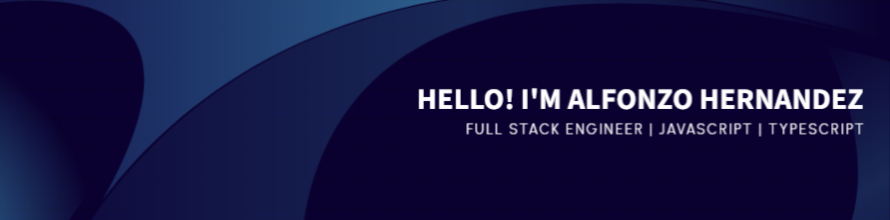

<h1 align="center"> Hi there, I'm Alfonzo! 👋</h1> 

<a href="https://github.com/kattae23" target="_blank">  

<h2 align="center">I'm a self-taught FullStack developer from Venezuela :venezuela:</h2>

- 📧 You can reach me at alfonzodeveloper@gmail.com

# Some Tools I Use

  

  
|  |  |
| ------------- | ------------- |

